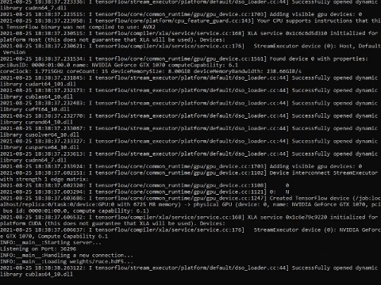

# N-ZeroX
(Neural)-Zero X is an AI that can play F-Zero X on BizHawk emulator using real time CNNs.
This repository is part of a Universidad de Sevilla's final degree project.

  
   
  

- [Watch the AI playing](https://www.youtube.com/)
- [Final Degree Project document](https://drive.google.com/)

## Set-up environtment

To run this project, you need **Python 3** and **Bizhawk** emulator.

### Install 64-bit Python 3
This project was written for [Python 3.7](https://www.python.org/ftp/python/3.7.9/python-3.7.9-amd64.exe). Tensorflow requires **64-bit Python**.

### Install Python Dependencies
The following Python **dependencies** need to be installed.

- Tensorflow 2.2.0
- Keras 2.3.1
- Pillow
- matplotlib
- mkdir_p
- h5py

### (Optional) Install CUDA and cuDNN
Although you can run Tensorflow on CPU, I'll recommend you to download and install [TensorFlow GPU](https://www.tensorflow.org/install/gpu) dependencies too.

|TensorFlow|Python|cuDNN|CUDA|
|----------|------|-----|----|
|2.2.0|3.5 to 3.8|7.6|10.1|

- [Get CUDA](https://developer.nvidia.com/cuda-toolkit-archive)
- [Get cuDNN](https://developer.nvidia.com/rdp/cudnn-archive) (you will need an nvidia account to access)

### Get BizHawk emulator

This project contains *LUA script* files ready to run on BizHawk emulator (tested on version 2.6.2). To get BizHawk you first need to install the [prerequisites](https://github.com/TASVideos/BizHawk-Prereqs/releases/tag/2.4.8_1). Then you can download [BizHawk](https://github.com/TASVideos/BizHawk/releases/tag/2.6.2) and unzip it to any directory.

>You will also need a F-Zero X ROM to run on BizHawk emulator.

### Download Pre-trained Weights and Recordings
Download this data to run the demo. You can also download my recordings to train the models by yourself. These should be *unzipped* into the folder of this repository.

- [Save States](https://drive.google.com/file/d/1Yh2GAGrdKH6aOy0FPPVk8fZsB4wrjRlX/) - LUA scripts will access the *saved states* on `states/[file].state`.
- [Weights](https://drive.google.com/file/d/1PkUX3UGLQTdg7otG4OChcrcXBP9skLzV/) - Python scripts will access the *trained models* on `weights/[model].hdf5`
- [Recordings (Optional)](https://drive.google.com/file/d/12Pr6pjZn1EJ_HNvxgYZmXGuHbuGJ-SIv/) - The recordings should be accessible as `recordings/[recording]/[frame].png`.

>Recordings file is almost 1GB. It contains >12000 game samples as screenshots.

## Usage Instructions
You must run .py files directly from console and .lua files from BizHaw Lua Console. You can find all lua files on `scripts` folder.

### Running the Demo
These instructions can be used to run a demo on Mute City using the `demo` model.

1. Download the save states and pre-trained model.
2. Run `predict-server.py` using Python - this starts a server on port `36296` which actually runs the model.
    - You must specify the model you want to run. Use `demo` as first parameter.
    - You can pass a `--cpu` to force Tensorflow to run on the CPU.
3. Open BizHawk and load a F-Zero X ROM.
4. Turn off messages (View > Display Messages).
    - You don't have to do this, but they get in the way.
4. Open the BizHawk Lua console (Tools > Lua Console).
5. Load `Demo.lua`

This should automatically play Mute City time attack race.  You can hit the arrow keys to manually steer the Blue Falcon. This can be used to demonstrate the AI's stability.

### Generate your own training data
The first thing you need to train your model is training data. You can generate training data using `Record.lua` and `RecordImput.lua`.
1. Open BizHawk and load a F-Zero X ROM.
2. Open the BizHawk Lua console (Tools > Lua Console).
3. Load `RecordImput.lua`
4. Play for a while (I'll recommend to use a joystick or game controller)

A new folder will be created on `recordings`. A screenshot will be stored everytime you move the joystick playing the game with the imput value stored on `steering.txt`

### Training the Model on Recordings
Once you have generated new recording, you probably want to try retraining the weights based off your recordings. To train a new model, run `train.py [model]`. You can also use `--cpu` to force it to use the CPU. Your trained model will be stored on `weights/[model].hdf5`

> You can include train data from train.zip along your own recordings.

### Play your trained model on a race
You can load the race savestate from `states/MuteCityGP.state` to test your new trained model.
Remember to launch `predict-server.py` first and load `Play.lua` from Lua console.

### Train AI to play on another track
You can use `Record.lua` and `RecordImput.lua` to generate training data for another track. Even for another game!
Remember to use a different name as parameter when you train your model with `train.py`.

## Reference Projects
- [NeuralKart](https://github.com/rameshvarun/NeuralKart) - This project was forked from rameshvarun real time Mario Kart AI.
- [TensorKart](https://github.com/kevinhughes27/TensorKart) - The first MarioKart deep learning project, used for reference.
